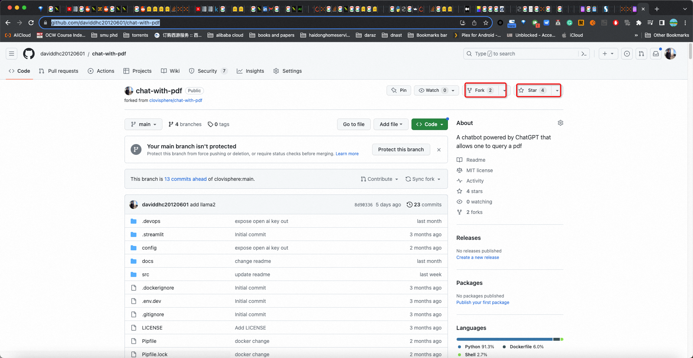
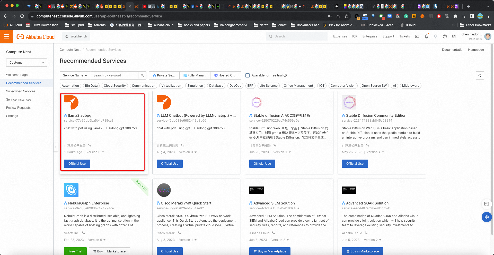
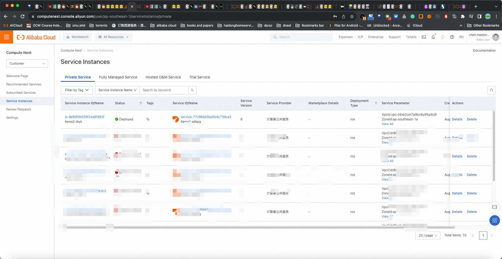
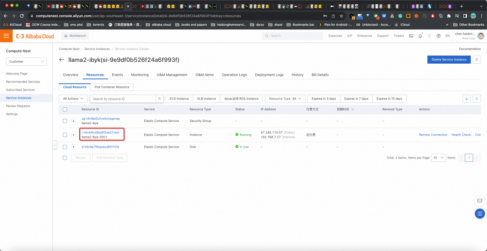
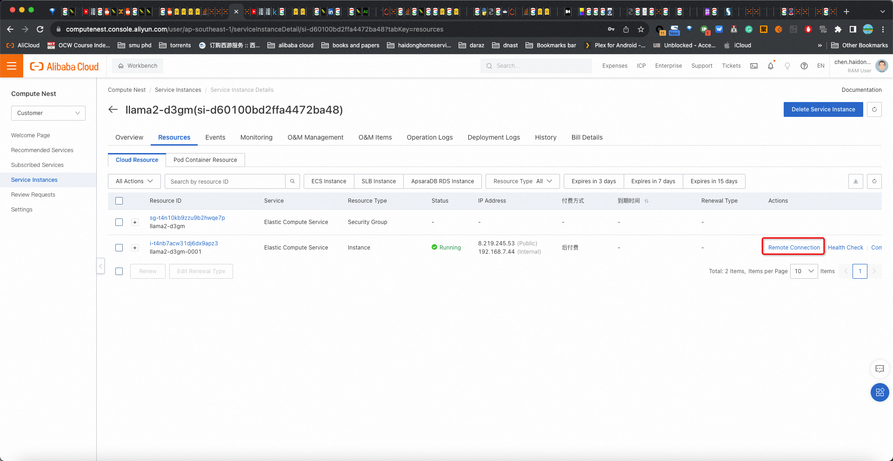

# Developer Guide for [Hackerthon](https://resource.alibabacloud.com/event/detail?id=6854)

*author: [David Haidong Chen](https://www.linkedin.com/in/davidhaidongchen/)

In this guide, we'll walk through the steps needed to fork, star, and further develop the `llama2` branch of the `chat-with-pdf` project hosted at [https://github.com/daviddhc20120601/chat-with-pdf ↗](https://github.com/daviddhc20120601/chat-with-pdf) The project is a chatbot powered by LLAMA2 and [AnalyticDB for PostgreSQL](https://www.alibabacloud.com/product/hybriddb-postgresql) that can query a PDF.

## Prerequisites

- A GitHub account
- An Alibaba Cloud account
- Basic knowledge of git commands
- Basic knowledge of Alibaba Cloud Compute Nest components

## Step 1: Fork and Star the Repository

1. Navigate to the `chat-with-pdf` repository located at [https://github.com/daviddhc20120601/chat-with-pdf ↗](https://github.com/daviddhc20120601/chat-with-pdf)
1. In the top-right corner of the repository, click the `Fork` button and select where you want to fork the repository. The repository is now copied to your GitHub account.
1. Now, navigate to the `llama2` branch in the newly forked repository.
1. In the top-right corner of the repository, click the `Star` button. This will help you keep track of updates to the original project.

## Step 2: Start the haidong gpt llama2 on Alibaba Cloud Compute Nest Component

detail walk through [link from alibaba official blog post](https://www.alibabacloud.com/blog/600282)

1. Log into your Alibaba Cloud account.
1. Navigate to the Compute Nest component section.
1. Start the "llama2 adbpg" alias "Haidong gpt 300753". This will instantiate a new virtual machine in your Alibaba Cloud account.

## Step 3: Commit Code and Test Your Changes

1. Access the machine instantiated in Step 2. You can do this via SSH or any remote desktop tool.




* ssh
```
ssh root@{your ecs ip address}
{your password which you just set}
```
* remote desktop:

1. Once you've accessed the machine, clone your forked repository by running:
   ```
   git clone https://github.com/{Your_GitHub_Username}/chat-with-pdf.git
   ```
   Replace `{Your_GitHub_Username}` with your actual GitHub username.
1. Navigate to the cloned repository and switch to the `llama2` branch:
   ```
   cd chat-with-pdf
   git checkout llama2
   ```
1. Now you can start developing and adding your changes to the project. Remember to frequently commit and push your changes to your GitHub repository:
   ```
   git add .
   git commit -m "Your commit message"
   git push origin llama2
   ```
   after you push code, ssh on your remote machine and git pull
   ```
   git pull
   ```
1. After making your changes, run your code to ensure it works as expected.
   ```
   export PG_HOST=""
   export PG_PORT=5432
   export PG_DATABASE=""
   export PG_USER=""
   export PG_PASSWORD="!"
   streamlit run app.py
   ```
   it takes around 1-2 mins to start up the UI
## Conclusion

By following these steps, you'll have a fork of the `chat-with-pdf` project on the `llama2` branch in your GitHub account. You can then run the project on an Alibaba Cloud instance and develop further as per your requirements for the Hackathon. Remember to regularly commit and push your changes to your repository to ensure no work is lost.

Happy coding!