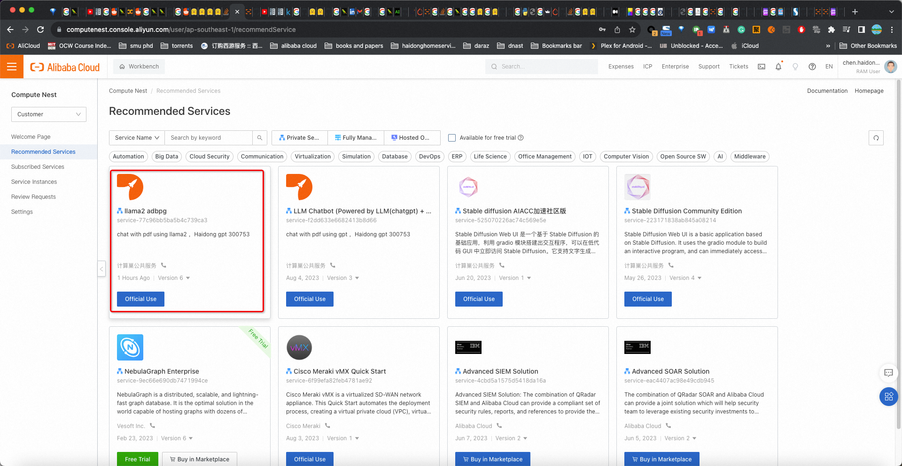
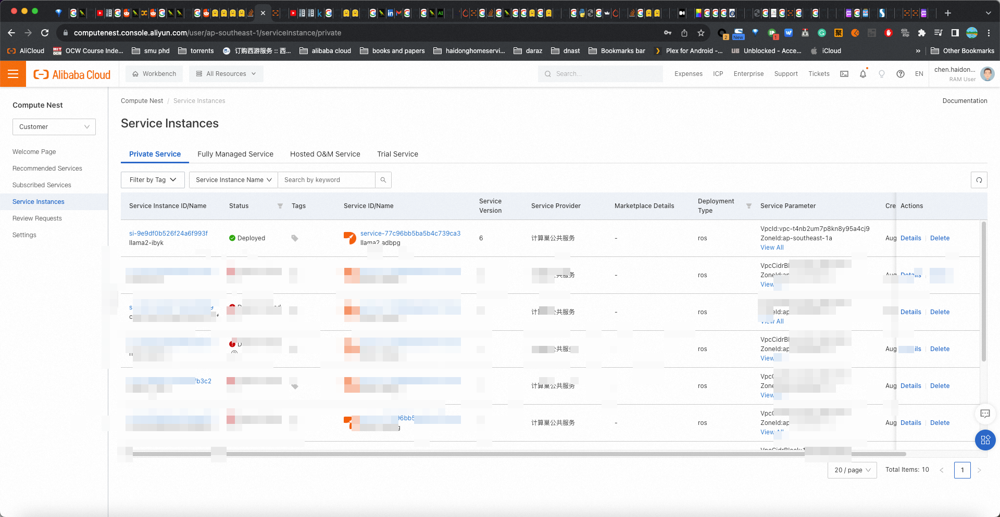
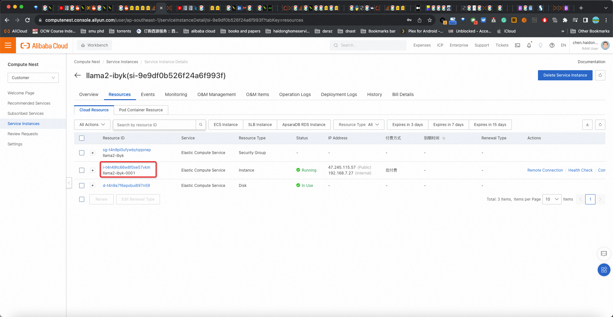

# Panduan Pengembang untuk [Hackerthon](https://resource.alibabacloud.com/event/detail?id=6854)

*author: [David Haidong Chen](https://www.linkedin.com/in/davidhaidongchen/)

Dalam panduan ini, kita akan membahas langkah-langkah yang diperlukan untuk melakukan fork, memberi bintang, dan mengembangkan lebih lanjut cabang `llama2` dari proyek `chat-with-pdf` yang dihosting di [https://github.com/daviddhc20120601/chat-with-pdf ↗](https://github.com/daviddhc20120601/chat-with-pdf) Proyek ini adalah chatbot yang didukung oleh LLAMA2 dan [AnalyticDB untuk PostgreSQL](https://www.alibabacloud.com/product/hybriddb-postgresql ) yang dapat meminta PDF.

## Prasyarat

- Akun GitHub
- Akun Alibaba Cloud
- Pengetahuan dasar tentang perintah git
- Pengetahuan dasar tentang komponen Alibaba Cloud Compute Nest

## Langkah 1: Garpu dan Bintangi Repositori

1. Buka repositori `chat-with-pdf` yang terletak di [https://github.com/daviddhc20120601/chat-with-pdf ↗](https://github.com/daviddhc20120601/chat-with-pdf)
1. Di pojok kanan atas repositori, klik tombol `Fork` dan pilih di mana Anda ingin melakukan fork pada repositori. Repositori sekarang disalin ke akun GitHub Anda.
1. Sekarang, navigasikan ke cabang `llama2` di repositori yang baru saja di-fork.
1. Di pojok kanan atas repositori, klik tombol `Bintang`. Ini akan membantu Anda melacak pembaruan ke proyek asli.

## Langkah 2: Mulai haidong gpt llama2 di Komponen Nest Komputasi Cloud Alibaba

detail berjalan melalui [tautan dari posting blog resmi alibaba](https://www.alibabacloud.com/blog/600282)

1. Masuk ke akun Alibaba Cloud Anda.
1. Buka bagian komponen Compute Nest.
1. Jalankan "llama2 adbpg" alias "Haidong gpt 300753". Ini akan membuat mesin virtual baru di akun Alibaba Cloud Anda.

## Langkah 3: Komit Kode dan Uji Perubahan Anda

1. Akses mesin yang dibuat pada Langkah 2. Anda dapat melakukannya melalui SSH atau alat desktop jarak jauh apa pun.


1. Setelah Anda mengakses mesin, tiru repositori bercabang Anda dengan menjalankan:
    ```
    git clone https://github.com/{Your_GitHub_Username}/chat-with-pdf.git
    ```
    Ganti `{Your_GitHub_Username}` dengan nama pengguna GitHub Anda yang sebenarnya.
1. Arahkan ke repositori kloning dan alihkan ke cabang `llama2`:
    ```
    cd obrolan-dengan-pdf
    git checkout llama2
    ```
1. Sekarang Anda dapat mulai mengembangkan dan menambahkan perubahan Anda ke proyek. Ingatlah untuk sering melakukan dan mendorong perubahan Anda ke repositori GitHub Anda:
    ```
    git tambahkan.
    git commit -m "Pesan komit Anda"
    git push origin llama2
    ```
1. Setelah melakukan perubahan, jalankan kode Anda untuk memastikannya berfungsi seperti yang diharapkan.
   ```
   export PG_HOST=""
   export PG_PORT=5432
   export PG_DATABASE=""
   export PG_USER=""
   export PG_PASSWORD="!"
   streamlit run app.py
   ```
## Kesimpulan

Dengan mengikuti langkah-langkah ini, Anda akan memiliki garpu proyek `chat-with-pdf` di cabang `llama2` di akun GitHub Anda. Anda kemudian dapat menjalankan proyek pada instans Alibaba Cloud dan mengembangkan lebih lanjut sesuai kebutuhan Anda untuk Hackathon. Ingatlah untuk melakukan dan mendorong perubahan Anda secara teratur ke repositori Anda untuk memastikan tidak ada pekerjaan yang hilang.

Selamat membuat kode!