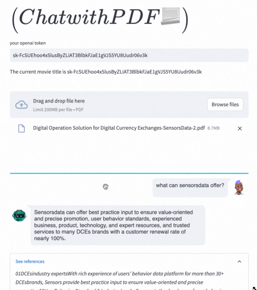
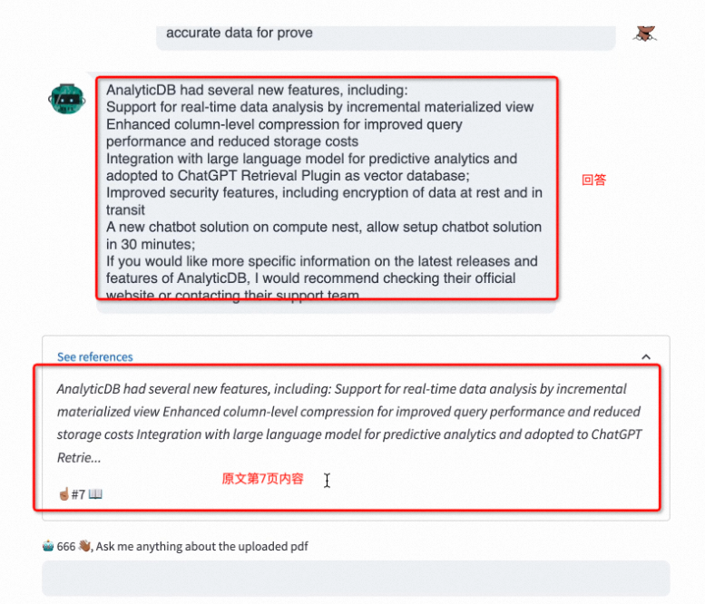
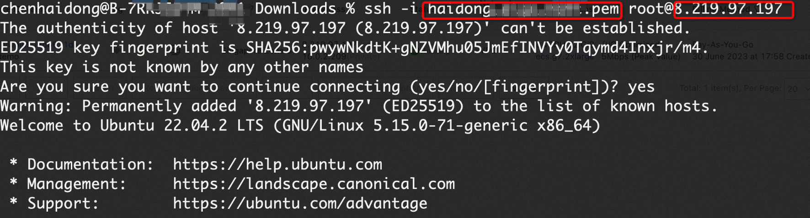
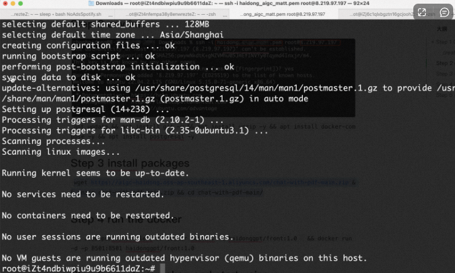
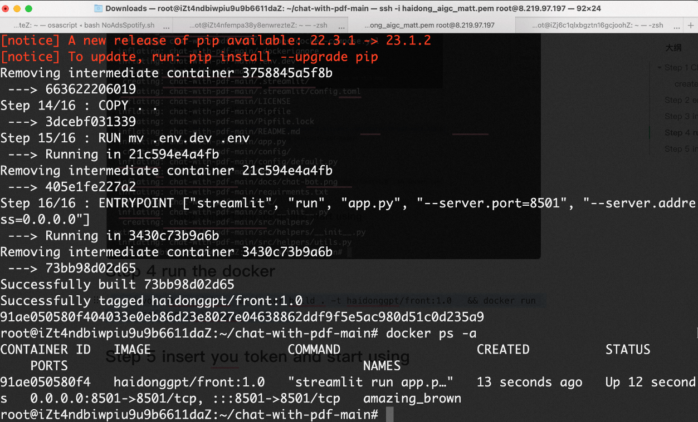
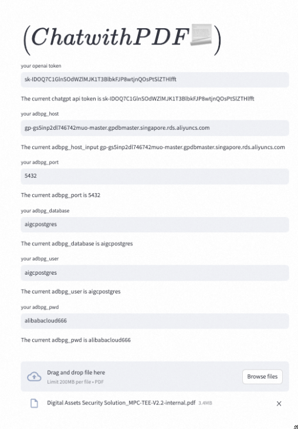

# preview demo video



# Step 1 Cloud resources
## 1.1 create ecs with security group 8501 open


# Step 2 env init


```apt update && apt install git -y && apt install unzip -y && apt install docker-compose -y && apt install postgresql -y```


# Step 3 install packages
```git clone https://github.com/daviddhc20120601/chat-with-pdf.git && cd chat-with-pdf/```


# Step 4 run the docker
```cp .devops/Dockerfile . && docker build . -t haidonggpt/front:1.0   && docker run -d -p 8501:8501 haidonggpt/front:1.0```


# Step 5 insert you token and start using

## 5.1 chatgpt token:
[steps](https://help.openai.com/en/articles/4936850-where-do-i-find-my-secret-api-key)
